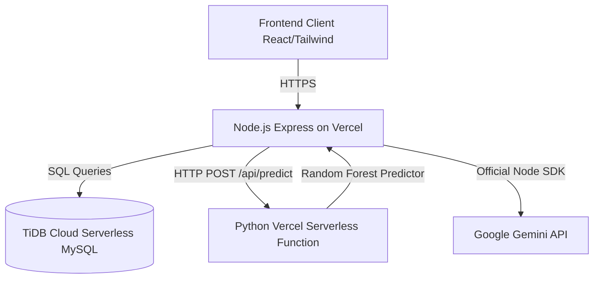

# Technical Design Document - Fresh Ledger

## 1. System Architecture


---

## 2. Database Schema (MySQL Compatible)

### Schema DDL Statements

```sql
-- 1. Users Table (RBAC)
CREATE TABLE users (
    id INT AUTO_INCREMENT PRIMARY KEY,
    username VARCHAR(50) UNIQUE NOT NULL,
    password VARCHAR(255) NOT NULL,
    role ENUM('staff', 'manager') NOT NULL DEFAULT 'staff',
    created_at TIMESTAMP DEFAULT CURRENT_TIMESTAMP
);

-- 2. Ingredients Table
CREATE TABLE ingredients (
    id INT AUTO_INCREMENT PRIMARY KEY,
    name VARCHAR(100) UNIQUE NOT NULL,
    category VARCHAR(50) NOT NULL,
    unit VARCHAR(10) NOT NULL -- 'kg', 'pcs', 'gr', 'liter'
);

-- 3. Stock Batches Table
CREATE TABLE stock_batches (
    id INT AUTO_INCREMENT PRIMARY KEY,
    ingredient_id INT NOT NULL,
    quantity DECIMAL(10,2) NOT NULL,
    remaining_quantity DECIMAL(10,2) NOT NULL,
    unit_price DECIMAL(10,2) NOT NULL,
    total_price DECIMAL(10,2) NOT NULL,
    receipt_image_path VARCHAR(255) NULL,
    status ENUM('active', 'used', 'wasted') DEFAULT 'active',
    expiry_date DATE NOT NULL,
    created_at TIMESTAMP DEFAULT CURRENT_TIMESTAMP,
    FOREIGN KEY (ingredient_id) REFERENCES ingredients(id) ON DELETE CASCADE
);

-- 4. Menu Items Table
CREATE TABLE menu_items (
    id INT AUTO_INCREMENT PRIMARY KEY,
    name VARCHAR(100) UNIQUE NOT NULL,
    price DECIMAL(10,2) NOT NULL,
    description TEXT NULL
);

-- 5. Menu Ingredients (Many-to-Many junction)
CREATE TABLE menu_ingredients (
    id INT AUTO_INCREMENT PRIMARY KEY,
    menu_item_id INT NOT NULL,
    ingredient_id INT NOT NULL,
    quantity_needed DECIMAL(10,2) NOT NULL,
    FOREIGN KEY (menu_item_id) REFERENCES menu_items(id) ON DELETE CASCADE,
    FOREIGN KEY (ingredient_id) REFERENCES ingredients(id) ON DELETE CASCADE
);

-- 6. Promo Drafts Table
CREATE TABLE promo_drafts (
    id INT AUTO_INCREMENT PRIMARY KEY,
    menu_item_id INT NOT NULL,
    discount_percentage INT NOT NULL, -- e.g. 10, 20, 30
    reason TEXT NOT NULL,
    status ENUM('pending_approval', 'active', 'expired') DEFAULT 'pending_approval',
    created_at TIMESTAMP DEFAULT CURRENT_TIMESTAMP,
    updated_at TIMESTAMP DEFAULT CURRENT_TIMESTAMP ON UPDATE CURRENT_TIMESTAMP,
    FOREIGN KEY (menu_item_id) REFERENCES menu_items(id) ON DELETE CASCADE
);

-- 7. Sales History Table (For ML predictions)
CREATE TABLE sales_history (
    id INT AUTO_INCREMENT PRIMARY KEY,
    ingredient_id INT NOT NULL,
    quantity_used DECIMAL(10,2) NOT NULL,
    sale_date DATE NOT NULL,
    FOREIGN KEY (ingredient_id) REFERENCES ingredients(id) ON DELETE CASCADE
);
```

---

## 3. API Contract

### **Auth Endpoints**
* **POST `/api/auth/login`**
  - Request: `{"username": "rilo", "password": "password123"}`
  - Response: `200 OK` -> `{"token": "JWT_TOKEN", "user": {"id": 1, "username": "rilo", "role": "manager"}}`

### **Stock Endpoints**
* **POST `/api/stock` (Form-data for receipt upload + manual fields)**
  - Body: `ingredient_id`, `quantity`, `unit_price`, `expiry_date`, `receipt` (file)
  - Response: `201 Created` -> `{"message": "Stock logged successfully", "data": {...}}`
* **GET `/api/stock`**
  - Response: `200 OK` -> `[{"id": 1, "name": "Daging Sapi", "quantity": 10.0, "expiry_date": "2026-07-20", "status": "active"}]`
* **PUT `/api/stock/:id/status`**
  - Request: `{"status": "used" | "wasted"}`
  - Response: `200 OK` -> `{"message": "Stock status updated"}`

### **Analytics & Reports**
* **GET `/api/analytics/waste-index`**
  - Response: `200 OK` -> `{"waste_index": 12.5, "total_spent": 1000000, "total_wasted": 125000}`
* **GET `/api/analytics/export-excel`**
  - Response: Generates and downloads a `.xlsx` file.

### **Promo Rescue (AI)**
* **POST `/api/promo/rescue`**
  - Triggered automatically or manually when stock hits expiry < 2 days.
  - Body: `{"stock_batch_id": 1}`
  - Response: Runs Gemini API, saves a draft in `promo_drafts`, and returns:
    `201 Created` -> `{"message": "Promo recommendation generated", "draft": {"id": 1, "menu_name": "Sapi Lada Hitam", "discount": 20}}`
* **GET `/api/promo/drafts`**
  - Response: List of `pending_approval` drafts.
* **PUT `/api/promo/drafts/:id/approve`**
  - Request: `{"status": "active"}`
  - Response: `200 OK` -> `{"message": "Promo activated"}`

### **ML Prediction (Python Serverless Function)**
* **POST `/api/predict`**
  - Body: `{"ingredient_id": 1, "history": [10.2, 12.4, 9.8]}` (array of weekly or monthly usage values)
  - Response: `200 OK` -> `{"predicted_demand": 11.5}`

---

## 4. AI & ML Integration Details

### **Gemini API RAG/Prompt Design (Promo Rescue)**
The Node.js backend retrieves:
- The ingredient name and quantity from the critical stock batch.
- The list of restaurant menus that depend on this ingredient (from `menu_ingredients`).

It sends the following structured prompt to the Gemini API (`gemini-2.5-flash-preview-09-2025`):
```text
System Prompt: You are a professional culinary business optimizer. Your goal is to rescue critical raw food stock that is expiring soon by recommending menu items to discount.
Return only a valid JSON object matching this schema:
{
  "menu_item_id": number,
  "discount_percentage": number (10 to 30, integer),
  "reason": "Clear explanation explaining why this menu was selected and why this discount percentage reduces losses"
}

Context:
Ingredient Expiring: {name: "Beef", quantity: "5 kg", expiry: "2 days"}
Available Menus using Beef:
- Menu ID: 10, Name: "Beef Black Pepper", price: 50000
- Menu ID: 11, Name: "Beef Teriyaki", price: 45000
```

---

## 5. Folder Structure
```
fresh-ledger/
├── api/
│   ├── index.js             # Entry point for Express API (Vercel Node)
│   └── predict.py           # Vercel Python Serverless Function (Ruben's ML)
├── src/
│   ├── config/
│   │   └── database.js      # TiDB Connection setup
│   ├── controllers/
│   │   ├── authController.js
│   │   ├── stockController.js
│   │   ├── promoController.js
│   │   └── analyticsController.js
│   ├── routes/
│   │   ├── auth.js
│   │   ├── stock.js
│   │   ├── promo.js
│   │   └── analytics.js
│   ├── services/
│   │   ├── geminiService.js
│   │   └── seedService.js
│   └── utils/
│       └── excelGenerator.js
├── vercel.json
├── package.json
└── requirements.txt         # Python dependencies (scikit-learn, numpy)
```
